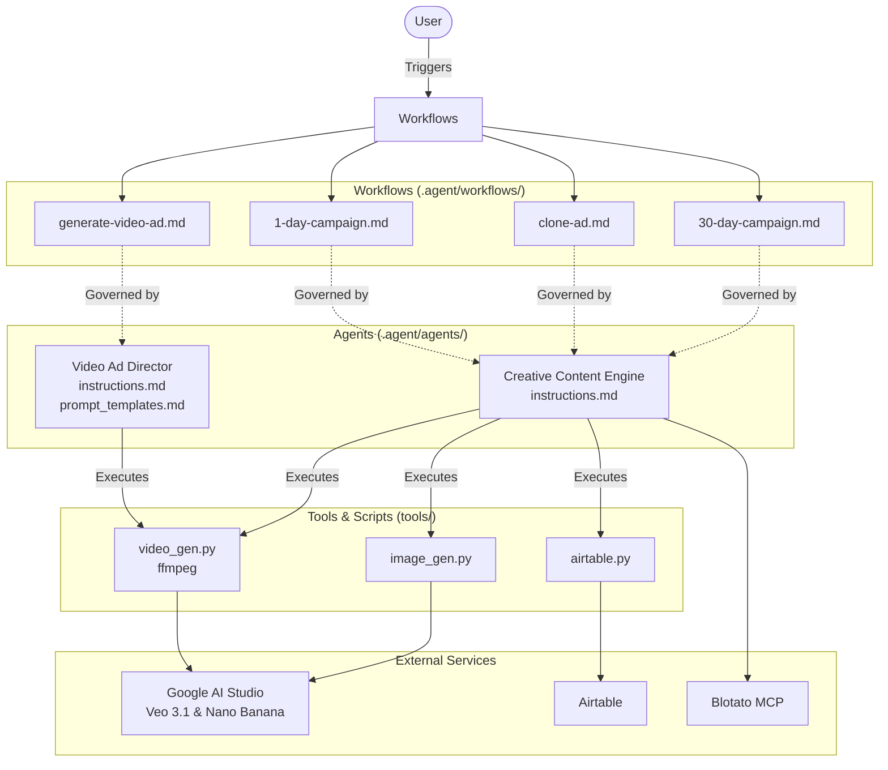

# Marketing Bot Architecture

Here is a diagram showing how your Workflows, Agents, Python Tools, and External Services interact within your project:

```mermaid
graph TD
    User([User]) -->|Triggers| Workflows
    
    subgraph "Workflows (.agent/workflows/)"
        W1[30-day-campaign.md]
        W2[clone-ad.md]
        W3[generate-video-ad.md]
        W4[1-day-campaign.md]
    end
    
    Workflows --> W1 & W2 & W3 & W4

    subgraph "Agents (.agent/agents/)"
        A1[Creative Content Engine<br/>instructions.md]
        A2[Video Ad Director<br/>instructions.md<br/>prompt_templates.md]
    end

    %% Workflow to Agent relationships
    W1 -.->|Governed by| A1
    W2 -.->|Governed by| A1
    W4 -.->|Governed by| A1
    W3 -.->|Governed by| A2
    
    subgraph "Tools & Scripts (tools/)"
        T1[image_gen.py]
        T2[video_gen.py<br/>ffmpeg]
        T3[airtable.py]
    end
    
    %% Agent to Tool relationships
    A1 -->|Executes| T1 & T2 & T3
    A2 -->|Executes| T2
    
    subgraph "External Services"
        E1[Google AI Studio<br/>Veo 3.1 & Nano Banana]
        E2[Airtable]
        E3[Blotato MCP]
    end
    
    %% Tool to Service relationships
    T1 & T2 --> E1
    T3 --> E2
    A1 --> E3
```
